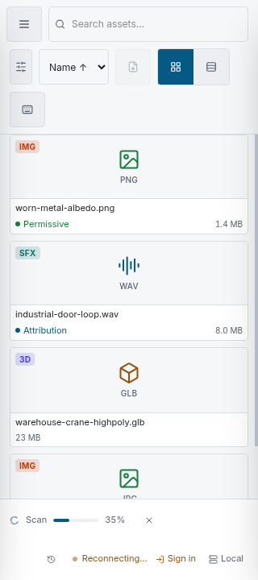
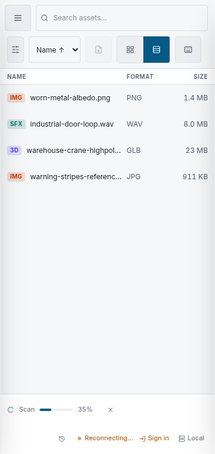
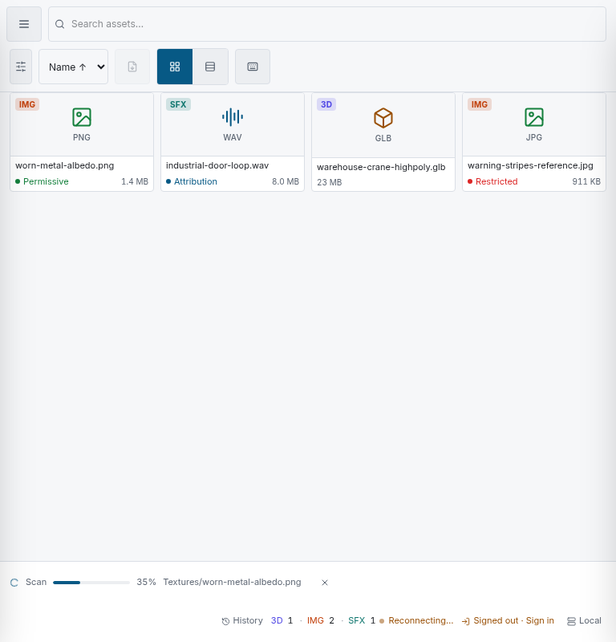
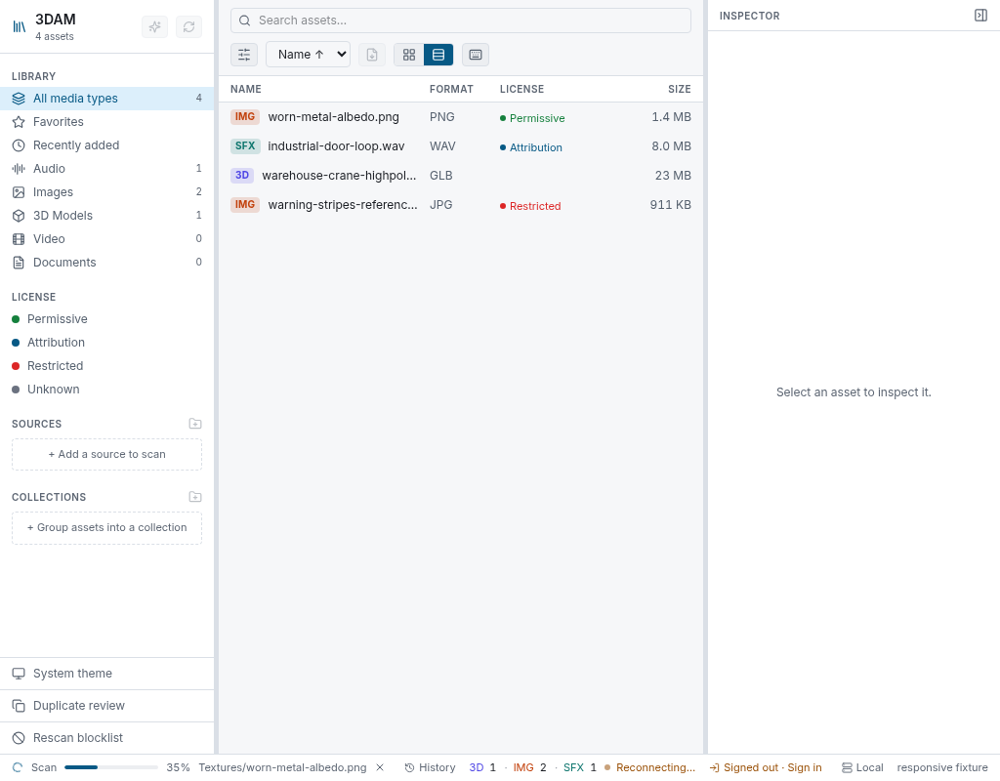

# Responsive workspace validation

Issue [#110](https://github.com/krazyjakee/3DAM/issues/110) defines the workspace’s compact chrome.
The checked-in captures below exercise the two phone widths, tablet width, and a desktop whose
expanded default rails constrain the centre pane to roughly 500 px. Each capture is produced by
`web/scripts/capture-responsive-workspace.mjs`, which also fails if the document is wider than its
viewport or if the Browser toolbar/status footer did not render.

| Scenario | Expected treatment | Capture |
|---|---|---|
| 320 × 720, touch | Full-width search; wrapped filters/actions; job and connection/identity rows; no page overflow |  |
| 360 × 760, touch, table selected | Three-column narrow table contract (name, format, size); touch-sized grid/table and status actions |  |
| 768 × 800, touch | Two-row toolbar with all actions visible and a meaningfully sized search field |  |
| 1024 × 800 desktop, table selected | Expanded Navigation and Inspector squeeze the centre pane; container queries wrap toolbar and reduce table columns |  |

## Reproduce

1. In `web/`, run `pnpm dev`.
2. In another shell, run `cd web && pnpm visual:responsive`.

Set `RESPONSIVE_BASE_URL` when Vite is not on `http://127.0.0.1:5173`, and `CHROMIUM` when the
browser executable is not named `chromium`. The script overwrites the four PNGs and
`manifest.json`; review those diffs like any other visual regression artifact. By default it
intercepts API requests with a deterministic four-asset fixture, including one active cancellable
scan job and anonymous sign-in posture, so capture does not depend on a database or Rust build. Set
`RESPONSIVE_LIVE_API=1` to exercise a server configured through the normal Vite proxy instead.

## Keyboard and touch checks

- Tab reaches navigation, the search input, Advanced filters, sort, export, both Grid/Table buttons,
  keyboard help, batch actions, job History, sign-in/sign-out, and server connection in DOM order.
- The phone footer keeps an active job and its labelled Cancel button on a full-width first row;
  History, live connection state, identity/sign-in, and server connection wrap below it.
- Coarse-pointer media queries retain 44 px minimum targets. No responsive action is `display:none`
  except descriptive count/version/media text and redundant button labels whose icon buttons keep
  explicit accessible names.
- The table retains its roving-focus asset rows while hiding Detail below 672 px of centre-pane
  width and License below 448 px. The row’s accessible name still contains the complete asset
  description.
